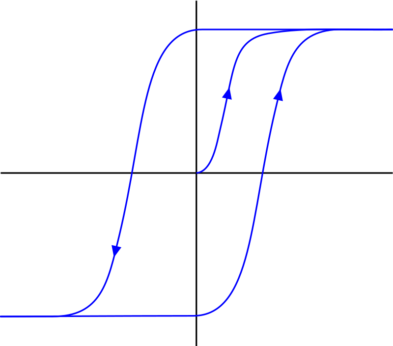

###### What is Markdown?
Markdown is a markup language (*linguaggio di formattazione*) developed in 2004 by Gruber and Swartz with the goal of create an easy-to-read / easy-to-write language simpler tha HTML. 
## 1) Headings 
# Main title
## Title level: 2 (Section)
### Title level: 3 (Subsection)
#### Title level: 4 (Subsubsection) 
##### Title level: 5
###### Title level: 6

## 2) Paragraph
The text does not go to the next line 
even when it is written in that way.  
Two whitespace are needed for a new line while two newline inputs

for a new paragraph.

## 3) Emphasis
There exists two ways for **bolding** __text__:  
use two * or two _ before and after the word.

Only one * is needed for get the text *italic* and a combination of three symbols for both the options.  
It is not possible to highlight words.  
A double ~ makes the text ~~strikethrough~~

## 4) Lists
It is sufficient to start the line with a number (such as 1.) for a numbered list  
while for a generic list one must begin with - o *

## 5) Blackquotes
Anteposing a > makes a block quotes as in the following example:
> Main the gap between the train and the platform.

## 6) Code
In order to instert code in a text one must antepose and postpose one blacktick ( Alt + 96 for windows) for codes in one line, or three of them for code in multiple lines:  
```
print('Hello Word')
```

## 7) Links 
URLs are automatically formatted in the right way:  
https://github.com/RicMattu/

It is possible to instert an hypertext reference writing the code:
`[GitHub Profile](https://github.com/RicMattu/)`
resulting:  
[GitHub Profile](https://github.com/RicMattu/)

## 8) Images
The command line for inserting an image is the following
``

Anyway, since Markdown has not a command for resizing the image, it is possible to insert HTML code for doing this:  
``  
  

## 9) Images that are links
Use this command line:
`[](https://en.wikipedia.org/wiki/Hysteresis)`
[](https://en.wikipedia.org/wiki/Hysteresis)

## Tables
## Documents
## Math 

